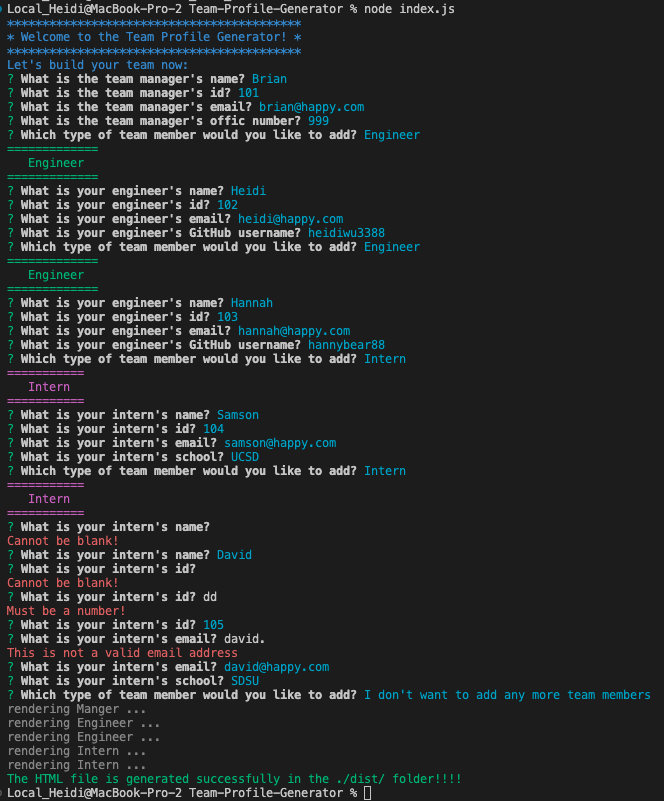
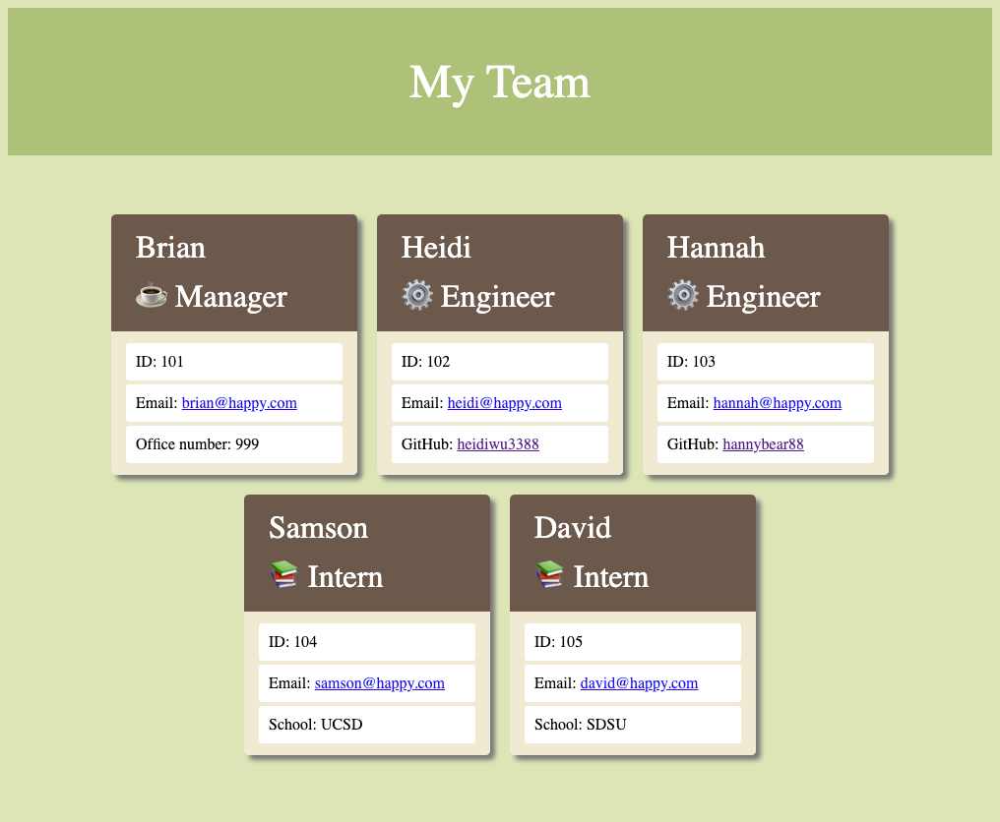

# Team-Profile-Generator
Module 10 - Object-Oriented Programming Challenge


## Description

It is a Node.js command-line application that takes in information about employees on a software engineering team and generates a HTML webpage that displays summaries for each person.

## Table of Contents
* [Installation](#installation)
* [Usage](#usage)
* [Screenshot](#screenshot)
* [Credits](#credits)
* [License](#license) 

## Installation
To install necessary dependencies, run the following command:
```
npm install
```

## Usage
Please refer to the [video](https://youtu.be/4aAlRKMEDSE) for the details of how to use the application.
- To use the application, run the command "node index.js", answer all the questions prompted, then a HTML file "index.html" will be generated that displays a nicely formated team roster based on user input.
- The generated HTML file is location in the folder ./dist/
- When the application starts, user is prompted to enter the team manager's name, employee ID, email address, and office number.
- After all the information of the team manager is input, the user will be presented with a menu with the option to add an engineer or an intern or to finish building the team.
- If "engineer" option is selected, the user will be prompted to enter the engineer's name, ID, email and GitHub username, and then the user will be taken back to the menu.
- If "intern" option is selected, the user will be prompted to enter the intern's name, ID, email and school, and then the user will be taken back to the menu.
- If "finish" option is selected, the HTML will be generated, and the application will be terminated.
- When the email address in the HTML is clicked, the user's default email program will be opened and address will be populated to the TO filed of the email.
- When the GitHub username in the HTML is clicked, the GitHub profile will be opened in a new tab.

## Screenshot

Sample Prompts and Answers



Sample generated HTML




## Credits

N/A

## License

None